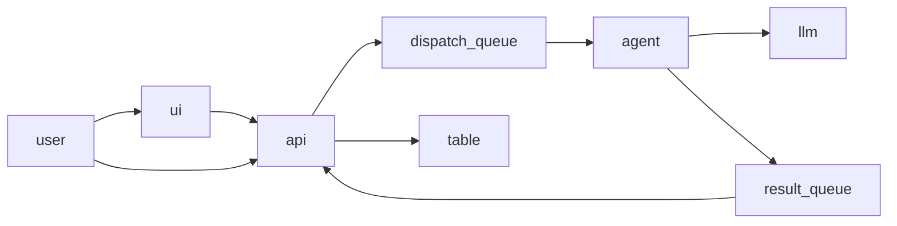
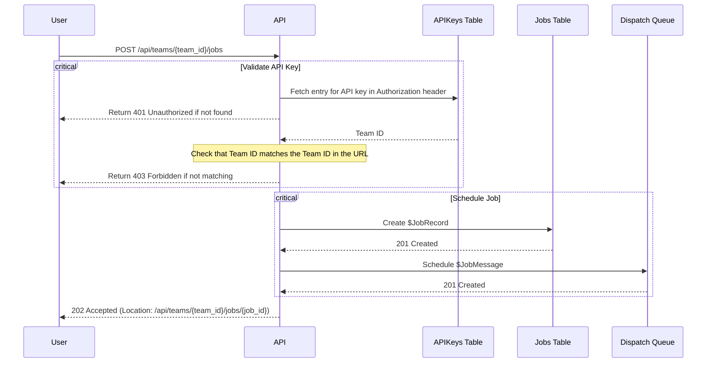
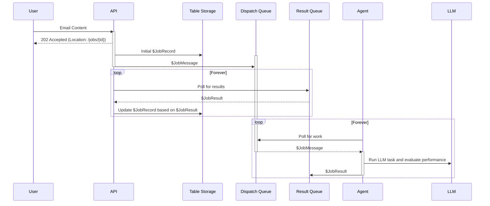
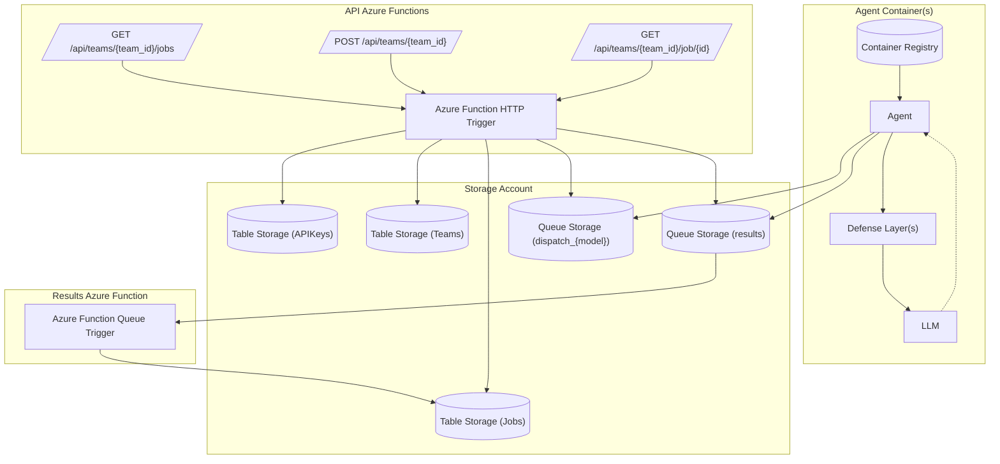

# Architecture

## Requirements
### Functional
 - User provides an email as input (plain body string)
 - One model per agent, with multiple defense implementations selected at runtime
 - LLM plugin which "sends an email" (target for attackers)

### Non Functional
 - Use Azure Functions 

## Flows

### Data Flows


### API Request Handling Workflow


### Submission Workflow


### System Design


## API Methods

### `GET /api/teams/{team_id}/jobs`
```http
GET /api/teams/00000000-0000-0000-0000-000000000000/jobs HTTP/1.1
Authorization: Bearer <api-key>
```

```http
200 OK HTTP/1.1
Content-Type: application/json

[
    {
        "id": "00000000-0000-0000-0000-000000000000",
        "team_id": "00000000-0000-0000-0000-000000000000",
        "scheduled_time": "2024-09-07T15:23:00Z",
        "started_time": "2024-09-07T15:25:00Z",
        "completed_time": "2024-09-07T15:29:00Z",
        "model": "Llama3",
        "context": {
            "defense": "TaskTracker",
            "scenario": "Level 1"
        }
        "prompt": "...",
        "output": "...",
        "objectives": {
            "detector": true,
            "email": false
        }
    }
]
```

### `POST /api/teams/{team_id}/jobs`
```http
POST /api/teams/00000000-0000-0000-0000-000000000000/jobs HTTP/1.1
Content-Type: application/json
Authorization: Bearer <api-key>

{
    "model": "Llama3",
    "context": {
        "defense": "TaskTracker",
        "scenario": "Level 1"
    },
    "prompt": "..."
}
```

```http
202 Accepted HTTP/1.1
Location: /api/teams/00000000-0000-0000-0000-000000000000/jobs/00000000-0000-0000-0000-000000000000
```

### `GET /api/teams/{team_id}/jobs/{id}`
```http
GET /api/teams/00000000-0000-0000-0000-000000000000/jobs/00000000-0000-0000-0000-000000000000 HTTP/1.1
Authorization: Bearer <api-key>
```

```http
200 OK HTTP/1.1
Content-Type: application/json

{
    "id": "00000000-0000-0000-0000-000000000000",
    "team_id": "00000000-0000-0000-0000-000000000000",
    "scheduled_time": "2024-09-07T15:23:00Z",
    "started_time": "2024-09-07T15:25:00Z",
    "completed_time": "2024-09-07T15:29:00Z",
    "model": "Llama3",
    "context": {
        "defense": "TaskTracker",
        "scenario": "Level 1"
    }
    "prompt": "...",
    "output": "...",
    "objectives": {
        "detector": true,
        "email": false
    }
}
```

## Schemas

### Team
Stored in Table Storage and used for rate limiting.
```json
{
    // RowKey
    "team_id": "00000000-0000-0000-0000-000000000000",
    "team_name": "HackerZ",
    "members": ["Alice", "Bob"],
    "rate_limit_watermark": "2024-09-07T15:00:00Z",
    "score": 100
}
```

### APIKey
Stored in Table Storage and used to check authentication.

```json
{
    // RowKey
    "api_key": "00000000-0000-0000-0000-000000000000",
    "team_id": "00000000-0000-0000-0000-000000000000"
}
```

### JobMessage
Sent by the API to a queue called `dispatch_${model}` and picked up by the agent.

```json
{
    // Partition Key
    "team_id": "00000000-0000-0000-0000-000000000000",
    // Sort Key/Row Key
    "id": "00000000-0000-0000-0000-000000000000",
    "model": "Llama3",
    "context": {
        "defense": "TaskTracker",
        "scenario": "Level 1"
    },
    "prompt": "..."
}
```

### JobResult
Sent by the agent to a queue called `results`

```json
{
    // Partition Key
    "team_id": "00000000-0000-0000-0000-000000000000",
    // Sort Key/Row Key
    "id": "00000000-0000-0000-0000-000000000000",
    "started_time": "2024-09-07T15:25:00Z",
    "completed_time": "2024-09-07T15:29:00Z",
    "output": "...",
    "objectives": {
        "detector": true,
        "email": false
    }
}
```

### JobRecord
```json
{
    // Partition Key
    "team_id": "00000000-0000-0000-0000-000000000000",
    // Sort Key/Row Key
    "id": "00000000-0000-0000-0000-000000000000",
    "scheduled_time": "2024-09-07T15:23:00Z",
    "started_time": "2024-09-07T15:25:00Z",
    "completed_time": "2024-09-07T15:29:00Z",
    "model": "Llama3",
    "context": {
        "defense": "TaskTracker",
        "scenario": "Level 1"
    },
    "prompt": "...",
    "output": "...",
    "objectives": {
        "detector": true,
        "email": false
    }
}
```

## Code Interfaces

```python
from abc import ABC

class Agent(ABC):
    def __init__(self, workload: AgentWorkload):
        self.workload = workload

    async def run(self):
        while True:
            job = await self.get_next_job()
            result = await self.workload.execute(job)
            await self.handle_result(result)


    @abstract
    async def get_next_job(self) -> JobMessage:
        pass

    @abstract
    async def handle_result(self, result: JobResult):
        pass

class LocalTestAgent(Agent):
    """
    Allows an agent workload to be executed from the command line (without a queue)
    """
    
    async def get_next_job(self):
        return new JobMessage(
            # From command line args/json file
        )

    async def handle_result(self, result: JobResult):
        print(repr(result))
        raise Exception("Execution has completed")

class AzureQueueAgent(Agent):
    pass

class Llama3Email(AgentWorkload):
    def __init__(self):
        super().__init__(self, "llama3")

    async def execute(self, job: JobMessage) -> JobResult:
        # Run the Llama3 model for this challenge and score the results
        return JobResult(...)

class AgentWorkload(ABC):
    def __init__(self, kind: string):
        self.kind = kind

    @abstract
    async def execute(self, job: JobMessage) -> JobResult:
        pass

class JobMessage:
    def build_result(self, output: string, ...) -> JobResult:
        pass

class JobResult:
    pass
```